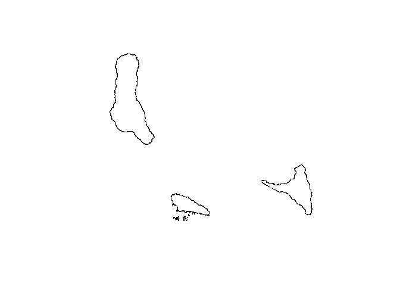
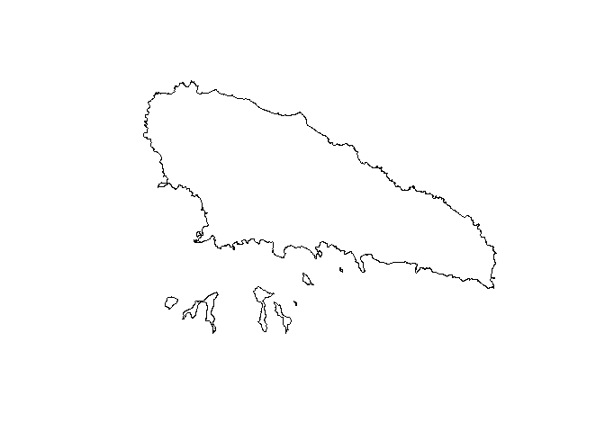
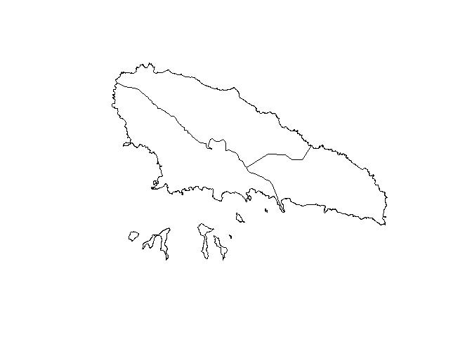

# Overview

The goal of comorosmpas is to get maps of Comoro Islands to plot!

# Installation

Install from CRAN with

``` r
install.packages("comorosmaps")
```

The development version of ozmaps may be installed directly from github.

``` r
devtools::install_github("hhousni/comorosmaps")
```

## Usage

Plot Comoro Islands as one country without region.

``` r
library(comorosmaps)
comorosmap()
```



Plot Comoro Islands as one country with region.

``` r
comorosmap(region = TRUE)
```


Plot Moheli Island without region.

``` r
comorosmap("moheli")
```



Plot Moheli Island with region.

``` r
comorosmap("moheli", region = TRUE)
```


