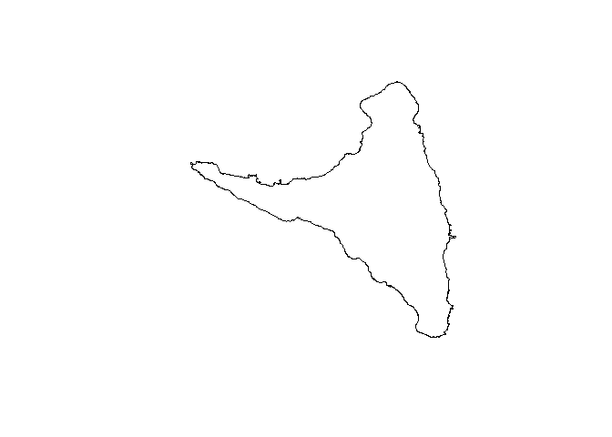
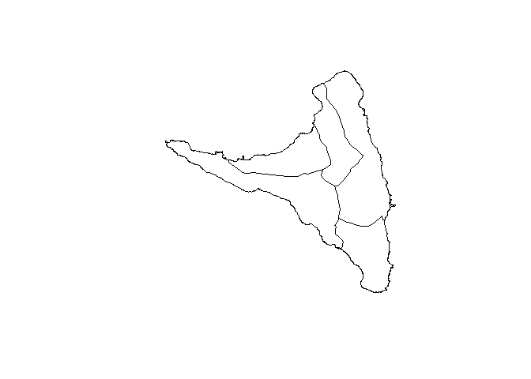
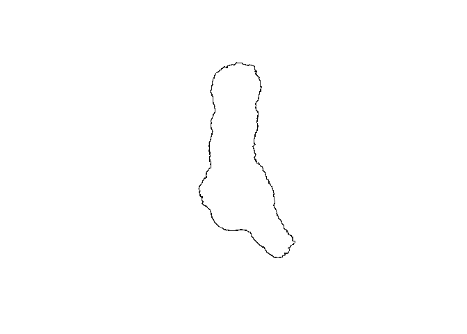
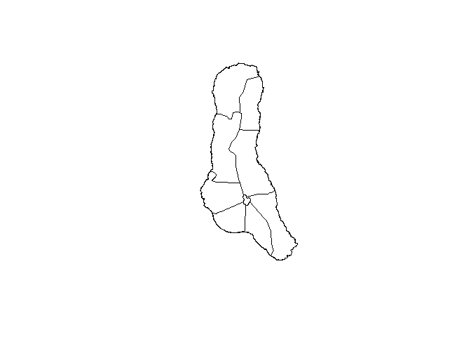

# Overview

The goal of comorosmpas is to get maps of Comoro Islands to plot!

# Installation

Install from CRAN with

``` r
install.packages("comorosmaps")
```

The development version of comorosmaps may be installed directly from
github.

``` r
devtools::install_github("hhousni/comorosmaps")
```

## Usage

Plot Comoro islands as one country without region.

``` r
library(comorosmaps)
comoros()
```


Plot Comoro islands as one country with region.

``` r
comoros(pref = TRUE)
```


Plot Moheli island without region.

``` r
moheli()
```


Plot Moheli island with region.

``` r
moheli(pref = TRUE)
```


Plot Anjouan island without region.

``` r
anjouan()
```



Plot Moheli island with region.

``` r
anjouan(pref = TRUE)
```



Plot Grande Comore island without region.

``` r
grandeComore()
```



Plot Grande Comore island with region.

``` r
grandeComore(pref = TRUE)
```


